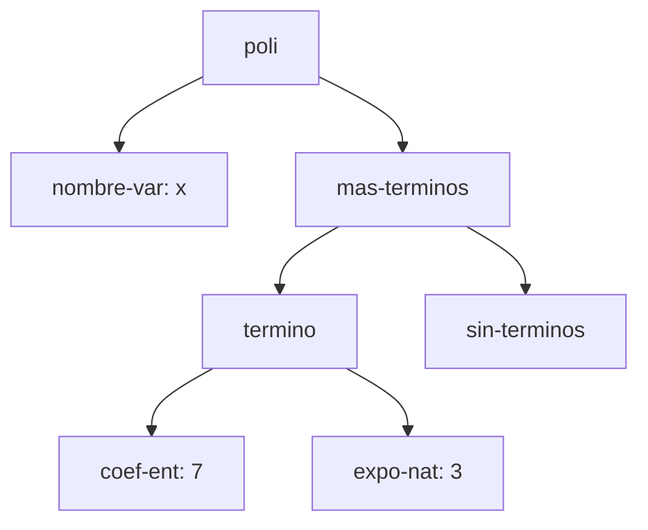
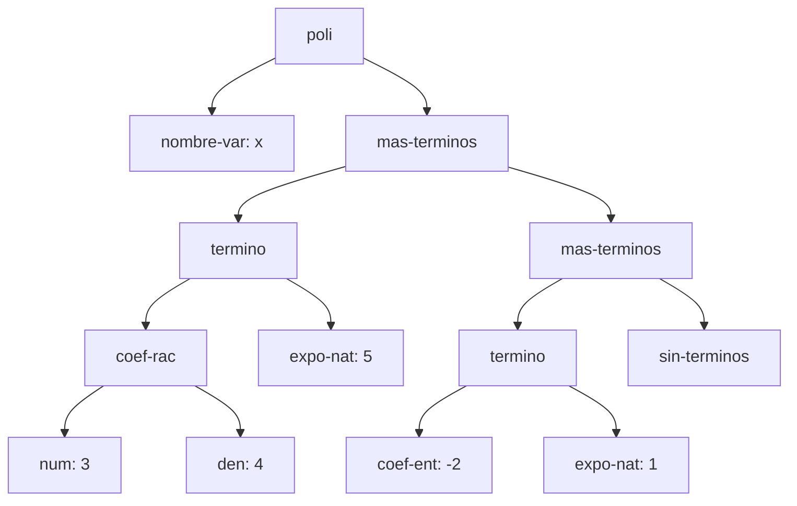
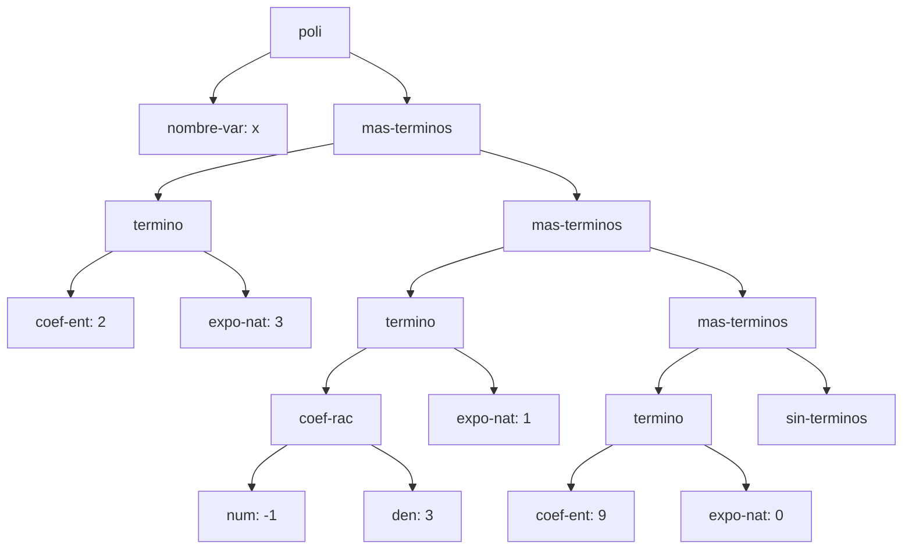
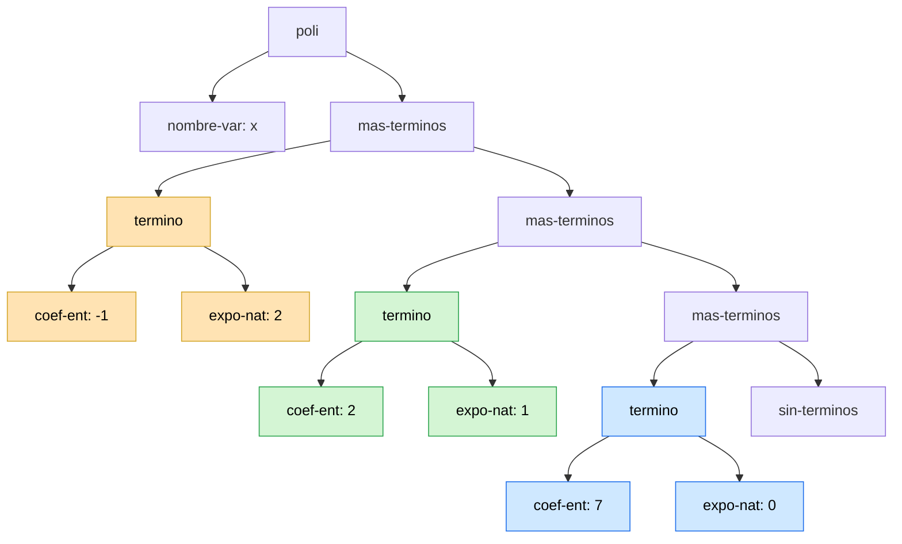

# Informe de AST — Taller 1: polinomios dispersos

**Curso:** Fundamentos de Interpretación y Compilación de Lenguajes
de Programación — Universidad del Valle, Sede Tuluá.

**Integrantes del grupo:**

| Nombre | Código | Correo institucional |
|--------|--------|----------------------|
| Josue David Cocoma Tascon | 2477087 | josue.cocoma@correounivalle.edu.co |
| Juan Diego Montaño Vergara | 2477334 | juan.diego.montano@correounivalle.edu.co |

---

## 1. Gramática considerada

Esta es la gramática del enunciado. Los nombres del recuadro son los
constructores que deben aparecer como etiquetas en los diagramas de la
sección 2.

```bnf
<polinomio>   ::= <variable> <terminos>
                   poli(var, terms)

<variable>    ::= <symbol>
                   nombre-var(s)

<terminos>    ::= '()
                   sin-terminos()
              ::= <termino> <terminos>
                   mas-terminos(term, resto)

<termino>     ::= <coeficiente> <exponente>
                   termino(coef, expo)

<coeficiente> ::= <int>
                   coef-ent(n)
              ::= <int> "/" <int>
                   coef-rac(num, den)

<exponente>   ::= <int>
                   expo-nat(k)
```

Cada no terminal se realiza en `polinomios-datatypes.rkt` con un
`define-datatype`. El nombre del tipo lleva el sufijo `-tad` para que no
coincida con el de ninguna variante (en particular `termino`):

| No terminal | Variantes del datatype | Campos |
|---|---|---|
| `<polinomio>` | `poli` | `var` (`variable-tad?`), `terms` (`terminos-tad?`); tipo `polinomio-tad` |
| `<variable>` | `nombre-var` | `s` (`symbol?`); tipo `variable-tad` |
| `<terminos>` | `sin-terminos`, `mas-terminos` | `sin-terminos`: sin campos; `mas-terminos`: `term` (`termino-tad?`), `resto` (`terminos-tad?`); tipo `terminos-tad` |
| `<termino>` | `termino` | `coef` (`coeficiente-tad?`), `expo` (`exponente-tad?`); tipo `termino-tad` |
| `<coeficiente>` | `coef-ent`, `coef-rac` | `coef-ent`: `n` (`integer?`); `coef-rac`: `num` y `den` (`integer?`); tipo `coeficiente-tad` |
| `<exponente>` | `expo-nat` | `k` (`integer?`); tipo `exponente-tad` |

---

## 2. Ejemplos de AST

Convenciones de los diagramas: cada nodo lleva el nombre de un constructor
de la gramática; los nodos hoja de datos primitivos se escriben como
`campo: valor`. La lista de términos se cierra siempre con `sin-terminos`.

### Ejemplo 1 — un solo término con coeficiente entero

**Polinomio:** $p_1 = 7x^{3}$

**Construcción:**

```scheme
(poli (nombre-var 'x)
      (mas-terminos (termino (coef-ent 7) (expo-nat 3))
                    (sin-terminos)))
```

**AST:**



**Explicación:** El hijo izquierdo de `poli` es `nombre-var`, que guarda el
símbolo `x`; el derecho es la lista de términos. Esa lista tiene un solo
`mas-terminos` cuyo primer campo es el único `termino` y cuyo resto es
`sin-terminos`: el caso base que cierra la recursión. El coeficiente
(`coef-ent: 7`) y el exponente (`expo-nat: 3`) son nodos separados porque
pertenecen a categorías distintas de la gramática: el coeficiente puede ser
entero o racional (dos variantes) y el exponente siempre es un natural, y
cada categoría tiene sus propios constructores y reglas.

---

### Ejemplo 2 — dos términos, uno con coeficiente racional

**Polinomio:** $p_2 = \frac{3}{4}x^{5} - 2x$

**Construcción:**

```scheme
(poli (nombre-var 'x)
      (mas-terminos (termino (coef-rac 3 4) (expo-nat 5))
                    (mas-terminos (termino (coef-ent -2) (expo-nat 1))
                                  (sin-terminos))))
```

**AST:**



**Explicación:** El subárbol de `coef-rac` tiene dos hijos, `num` y `den`,
porque el racional se guarda con numerador y denominador por separado (la
barra de la gramática no es un token); el de `coef-ent` es una sola hoja con
el entero. Así `3/4` es un nodo con dos datos y `-2` un nodo con uno. El
orden decreciente que exige el invariante se ve al recorrer la espina de
`mas-terminos` de arriba hacia abajo: el primer `termino` tiene
`expo-nat: 5` y el segundo `expo-nat: 1`, y $5 > 1$. Además ninguno tiene
coeficiente cero y el racional ya está reducido ($\gcd(3,4)=1$, $4>0$).

---

### Ejemplo 3 — tres o más términos, con término independiente

**Polinomio:** $p_3 = 2x^{3} - \frac{1}{3}x + 9$

**Construcción:**

```scheme
(poli (nombre-var 'x)
      (mas-terminos (termino (coef-ent 2) (expo-nat 3))
                    (mas-terminos (termino (coef-rac -1 3) (expo-nat 1))
                                  (mas-terminos (termino (coef-ent 9) (expo-nat 0))
                                                (sin-terminos)))))
```

**AST:**



**Explicación:** El término independiente $9$ es un `termino` como los
demás, con `coef-ent: 9` y `expo-nat: 0`: la gramática no tiene una variante
especial para él, porque $9 = 9x^{0}$ y $0$ es un natural válido
(condición 3 del invariante). Además, al ser el de menor exponente, siempre
queda de último, justo antes de `sin-terminos`. El signo del racional
$-\frac{1}{3}$ va en el numerador (`num: -1`) y el denominador es positivo
(`den: 3`), como pide la condición 4 del invariante.

---

### Ejemplo 4 — el resultado de `(sumar p q)`

Se usan los polinomios $p$ y $q$ del ejemplo de la Parte 3 del enunciado.

**Operandos:**

- $p = 4x^{5} - \frac{3}{2}x^{2} + 7$, construido como
  `(poli (nombre-var 'x) (mas-terminos (termino (coef-ent 4) (expo-nat 5)) (mas-terminos (termino (coef-rac -3 2) (expo-nat 2)) (mas-terminos (termino (coef-ent 7) (expo-nat 0)) (sin-terminos)))))`
- $q = -4x^{5} + \frac{1}{2}x^{2} + 2x$, construido como
  `(poli (nombre-var 'x) (mas-terminos (termino (coef-ent -4) (expo-nat 5)) (mas-terminos (termino (coef-rac 1 2) (expo-nat 2)) (mas-terminos (termino (coef-ent 2) (expo-nat 1)) (sin-terminos)))))`

**Resultado:** $p + q = -x^{2} + 2x + 7$

**AST del resultado:**



Colores: naranja = término que combina a $p$ y $q$; verde = término que
viene solo de $q$; azul = término que viene solo de $p$. Los nodos sin color
(`poli`, `nombre-var`, `mas-terminos`, `sin-terminos`) son la estructura de
la lista del resultado.

**Origen de cada nodo.**

| Término del resultado | Viene de | Observación |
|---|---|---|
| $-1\,x^{2}$ (`coef-ent: -1`, `expo-nat: 2`) | suma de ambos | $p$ aporta $-\frac{3}{2}$ y $q$ aporta $\frac{1}{2}$; $-\frac{3}{2}+\frac{1}{2} = -1$. El resultado es entero, por eso el nodo pasa de `coef-rac` a `coef-ent`: es un nodo nuevo, construido con `a-coeficiente`. |
| $2\,x^{1}$ (`coef-ent: 2`, `expo-nat: 1`) | $q$ | $p$ no tiene término de exponente 1, así que el término de $q$ pasa tal cual (se reutiliza el mismo nodo `termino`). |
| $7\,x^{0}$ (`coef-ent: 7`, `expo-nat: 0`) | $p$ | $q$ no tiene término independiente, así que el término de $p$ pasa tal cual. |

**Términos cancelados:** el término de exponente $5$. $p$ aporta
$\texttt{coef-ent}(4)$ y $q$ aporta $\texttt{coef-ent}(-4)$, y $4 + (-4) = 0$.
El invariante prohíbe los términos con coeficiente cero (condición 2), así
que `sumar` no construye ningún nodo `termino` para ese exponente: no hay un
`coef-ent: 0` en el árbol y la lista de términos del resultado pasa
directamente del cancelado a los siguientes. Por eso el resultado tiene tres
términos y no cuatro (los exponentes $5, 2, 1, 0$ de la unión de $p$ y $q$,
menos el $5$ que se canceló), y mantiene el orden estricto
$2 > 1 > 0$.

---

## 3. Referencias

- Friedman, D. P., & Wand, M. *Essentials of Programming Languages*,
  3.ª ed., MIT Press, 2008. Sección 2.1 (especificación de datos),
  sección 2.2 (representaciones de un TAD), sección 2.4
  (`define-datatype` y `cases`).
- The Racket Reference, *Numbers*: https://docs.racket-lang.org/reference/numbers.html
